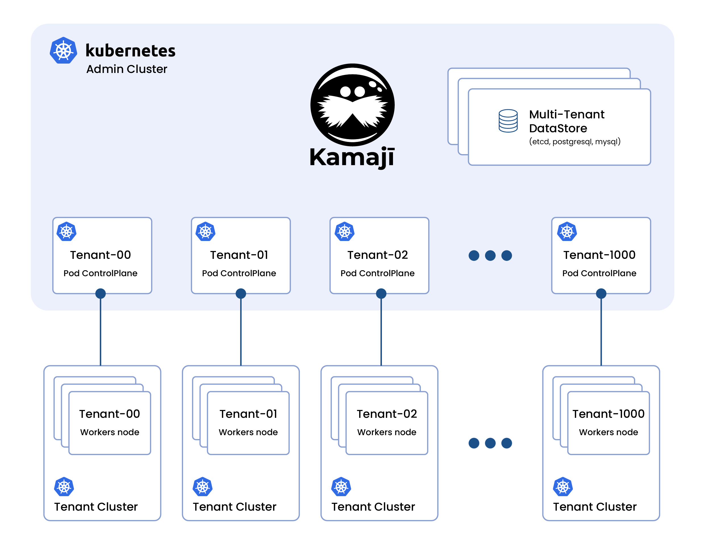

# Kamaji

  
  
  

**Kamaji** deploys and operates **Kubernetes Control Plane** at scale with a fraction of the operational burden. Kamaji is special because the Control Plane components are running in a single pod instead of dedicated machines. This solution makes running multiple Control Planes cheaper and easier to deploy and operate.

## Features

- **Self Service Kubernetes:** leave users the freedom to self-provision their Kubernetes clusters according to the assigned boundaries.
- **Multi-cluster Management:** centrally manage multiple clusters from a single admin cluster. Happy SREs. 
- **Cheaper Control Planes:** place multiple control planes on a single node, instead of having three nodes for a single control plane.
- **Stronger Multi-Tenancy:** leave users to access the control plane with admin permissions while keeping them isolated at the infrastructure level.
- **Kubernetes Inception:** use Kubernetes to manage Kubernetes by re-using all the Kubernetes goodies you already know and love.
- **Full APIs compliant:** all clusters are CNCF compliant built with upstream Kubernetes binaries

## Roadmap

- [x] Dynamic address on Load Balancer
- [x] Zero Downtime Tenant Control Plane upgrade
- [x] Join worker nodes from anywhere
- [x] Alternative datastore MySQL and PostgreSQL
- [x] Pool of multiple datastores
- [x] Seamless migration between datastores
- [ ] Automatic assignment to a datastore
- [ ] Autoscaling of Tenant Control Plane
- [x] Provisioning through Cluster APIs
- [ ] Terraform provider
- [ ] Custom Prometheus metrics for monitoring and alerting

## Documentation
Please, check the project's [documentation](https://kamaji.clastix.io/) for getting started with Kamaji.

## Contributions
Kamaji is Open Source with Apache 2 license and any contribution is welcome. Open an issue or suggest an enhancement on the GitHub [project's page](https://github.com/clastix/kamaji). Join the [Kubernetes Slack Workspace](https://slack.k8s.io/) and the [`#kamaji`](https://kubernetes.slack.com/archives/C03GLTTMWNN) channel to meet end-users and contributors.

## FAQs
Q. What does Kamaji mean?

A. Kamaji is named as the character _Kamaji_ from the Japanese movie [_Spirited Away_](https://en.wikipedia.org/wiki/Spirited_Away).

Q. Is Kamaji another Kubernetes distribution?

A. No, Kamaji is a Kubernetes Operator you can install on top of any Kubernetes cluster to provide hundreds or thousands of managed Kubernetes clusters as a service. We tested Kamaji on vanilla Kubernetes 1.22+, KinD, and Azure AKS. We expect it to work smoothly on other Kubernetes distributions. The tenant clusters made with Kamaji are conformant CNCF Kubernetes clusters as we leverage [`kubeadm`](https://kubernetes.io/docs/setup/production-environment/tools/kubeadm/).

Q. Is it safe to run Kubernetes control plane components in a pod instead of dedicated virtual machines?

A. Yes, the tenant control plane components are packaged in the same way they are running in bare metal or virtual nodes. We leverage the `kubeadm` code to set up the control plane components as they were running on their own server. The unchanged images of upstream `kube-apiserver`, `kube-scheduler`, and `kube-controller-manager` are used.

Q. You already provide a Kubernetes multi-tenancy solution with [Capsule](https://capsule.clastix.io). Why does Kamaji matter?

A. A multi-tenancy solution, like Capsule shares the Kubernetes control plane among all tenants keeping tenant namespaces isolated by policies. While the solution is the right choice by balancing between features and ease of usage, there are cases where a tenant user requires access to the control plane, for example, when a tenant requires to manage CRDs on his own. With Kamaji, you can provide cluster admin permissions to the tenant.

Q. Well you convinced me, how to get a try?

A. It is possible to get started with Kamaji on a laptop with [KinD](getting-started.md) installed.