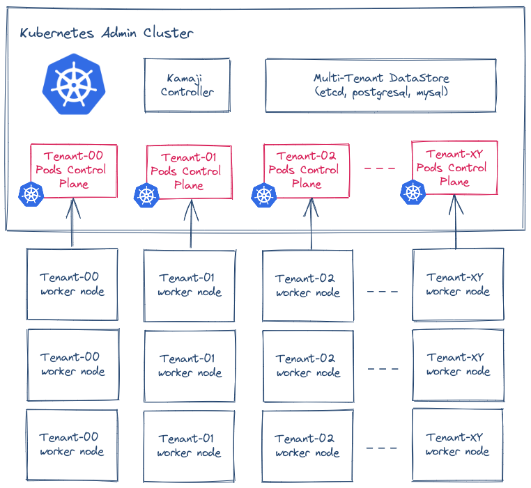

# Kamaji

  
  
  

**Kamaji** is a tool aimed to build and operate a **Managed Kubernetes Service** with a fraction of the operational burden. With **Kamaji**, you can deploy and operate hundreds of Kubernetes clusters as a hyper-scale cloud provider.

  

> This project is still in the early development stage which means it's not ready for production as APIs, commands, flags, etc. are subject to change, but also that your feedback can still help to shape it. Please try it out and let us know what you like, dislike, what works, what doesn't, etc.

## Why we are building it?
Global hyper-scalers are leading the Managed Kubernetes space, while regional cloud providers, as well as large corporations, are struggling to offer the same level of experience to their developers because of the lack of the right tools. Also, Kubernetes solutions for the on-premises are designed with an enterprise-first approach and they are too costly when deployed at scale. Project Kamaji aims to solve this pain by leveraging multi-tenancy and simplifying how to run Kubernetes clusters at scale with a fraction of the operational burden.

## How it works
Kamaji turns any CNCF conformant Kubernetes cluster into an _“admin cluster”_ to orchestrate other Kubernetes clusters we're calling _“tenant clusters”_. As with every Kubernetes cluster, a tenant cluster has a set of nodes and a control plane, composed of several components: `APIs server`, `scheduler`, `controller manager`. What Kamaji does is deploy those components as a pod running in the admin cluster.

And what about the tenant worker nodes? They are just worker nodes: regular instances, e.g. virtual or bare metal, connecting to the APIs server of the tenant cluster. Kamaji's goal is to manage the lifecycle of hundreds of these clusters, not only one, so how can we add another tenant cluster? As you could expect, Kamaji just deploys a new tenant control plane as a new pod in the admin cluster, and then it joins the new tenant worker nodes.

  

All the tenant clusters built with Kamaji are fully compliant CNCF Kubernetes clusters and are compatible with the standard Kubernetes toolchains everybody knows and loves.

  

## Save the state
Putting the tenant cluster control plane in a pod is the easiest part. Also, we have to make sure each tenant cluster saves the state to be able to store and retrieve data.

A dedicated `etcd` cluster for each tenant cluster doesn’t scale well for a managed service because `etcd` data persistence can be cumbersome at scale, rising the operational effort to mitigate it. So we have to find an alternative keeping in mind our goal for a resilient and cost-optimized solution at the same time. As we can deploy any Kubernetes cluster with an external `etcd` cluster, we explored this option for the tenant control planes. On the admin cluster, we deploy a multi-tenant `etcd` cluster storing the state of multiple tenant clusters.

With this solution, the resiliency is guaranteed by the usual `etcd` mechanism, and the pods' count remains under control, so it solves the main goal of resiliency and costs optimization. The trade-off here is that we have to operate an external `etcd` cluster and manage the access to be sure that each tenant cluster uses only its data. Also, there are limits in size in `etcd`, defaulted to 2GB and configurable to a maximum of 8GB. We’re solving this issue by pooling multiple `etcd` and sharding the tenant control planes.

## Getting started

Please refer to the [Getting Started guide](./docs/getting-started-with-kamaji.md) to deploy a minimal setup of Kamaji on KinD.

## Use cases
Kamaji project has been initially started as a solution for actual and common problems such as minimizing the Total Cost of Ownership while running Kubernetes at large scale. However, it can open a wider range of use cases. Here are a few:

### Managed Kubernetes
Enabling companies to provide Cloud Native Infrastructure with ease by introducing a strong separation of concerns between management and workloads. Centralize clusters management, monitoring, and observability by leaving developers to focus on the applications, increase productivity and reduce operational costs. 

### Kubernetes as a Service
Provide Kubernetes clusters in a self-service fashion by running management and workloads on different infrastructures and cost centers with the option of Bring Your Own Device - BYOD.

### Control Plane as a Service
Provide multiple Kubernetes control planes running on top of a single Kubernetes cluster. Tenants who use namespaces based isolation often still need access to cluster wide resources like Cluster Roles, Admission Webhooks, or Custom Resource Definitions.

### Edge Computing
Distribute Kubernetes workloads across edge computing locations without having to manage multiple clusters across various providers. Centralize management of hundreds of control planes while leaving workloads to run isolated on their own dedicated infrastructure.

### Cluster Simulation
Check new Kubernetes API or experimental flag or a new tool without impacting production operations. Kamaji will let you simulate such things in a safe and controlled environment.

### Workloads Testing
Check the behaviour of your workloads on different and multiple versions of Kubernetes with ease by deploying multiple Control Planes in a single cluster.

## Features

### Self Service Kubernetes
Leave users the freedom to self-provision their Kubernetes clusters according to the assigned boundaries.

### Multi-cluster Management
Centrally manage multiple tenant clusters from a single admin cluster. Happy SREs. 

### Cheaper Control Planes
Place multiple tenant control planes on a single node, instead of having three nodes for a single control plane.

### Stronger Multi-Tenancy
Leave tenants to access the control plane with admin permissions while keeping the tenant isolated at the infrastructure level.

### Kubernetes Inception
Use Kubernetes to manage Kubernetes by re-using all the Kubernetes goodies you already know and love.

### Full APIs compliant
Tenant clusters are fully CNCF compliant built with upstream Kubernetes binaries. A client does not see differences between a Kamaji provisioned cluster and a dedicated cluster.

## Roadmap

- [ ] Benchmarking and stress-test
- [x] Support for dynamic address allocation on native Load Balancer
- [x] Zero Downtime Tenant Control Plane upgrade
- [x] `konnectivity` integration
- [ ] Provisioning of Tenant Control Plane through Cluster APIs
- [ ] Prometheus metrics for monitoring and alerting
- [ ] `kine` integration, i.e. use MySQL, SQLite, PostgreSQL as datastore
- [ ] Deeper `kubeadm` integration
- [ ] `etcd` pooling

## Documentation
Please, check the project's [documentation](./docs/) for getting started with Kamaji.

## Contributions
Kamaji is Open Source with Apache 2 license and any contribution is welcome.

## Community
Join the [Kubernetes Slack Workspace](https://slack.k8s.io/) and the [`#kamaji`](https://kubernetes.slack.com/archives/C03GLTTMWNN) channel to meet end-users and contributors.

## FAQ
Q. What does Kamaji means?

A. Kamaji is named as the character _Kamaji_ from the Japanese movie [_Spirited Away_](https://en.wikipedia.org/wiki/Spirited_Away).

Q. Is Kamaji another Kubernetes distribution?

A. No, Kamaji is a tool you can install on top of any CNCF conformant Kubernetes to provide hundreds of managed Tenant clusters as a service. We tested Kamaji on vanilla Kubernetes 1.23+, KinD, and MS Azure AKS. We expect it to work smoothly on other Kubernetes distributions. The tenant clusters made with Kamaji are conformant CNCF Kubernetes vanilla clusters built with `kubeadm`.

Q. Is it safe to run Kubernetes control plane components in a pod?

A. Yes, the tenant control plane components are packaged in the same way they are running in bare metal or virtual nodes. We leverage the `kubeadm` code to set up the control plane components as they were running on a server. The same unchanged images of upstream `APIs server`, `scheduler`, `controller manager` are used.

Q. And what about multi-tenant `etcd`? I never heard of it.

A. Even if multi-tenant deployment for `etcd` is not a common practice, multi-tenancy, RBAC, and client authentication has been [supported](https://etcd.io/docs/v3.5/op-guide/authentication/) in `etcd` from a long time. 

Q. You already provide a Kubernetes multi-tenancy solution with [Capsule](capsule.clastix.io). Why does Kamaji matter?

A. Lighter Multi-Tenancy solutions, like Capsule shares the Kubernetes control plane among all tenants keeping tenant namespaces isolated by policies. While these solutions are the right choice by balancing between features and ease of usage, there are cases where a tenant user requires access to the control plane, for example, when a tenant requires to manage CRDs on his own. With Kamaji, you can provide admin permissions to the tenants.

Q. So I need a costly cloud infrastructure to try Kamaji?

A. No, it is possible to getting started Kamaji on your laptop with [KinD](./docs/getting-started-with-kamaji.md).
