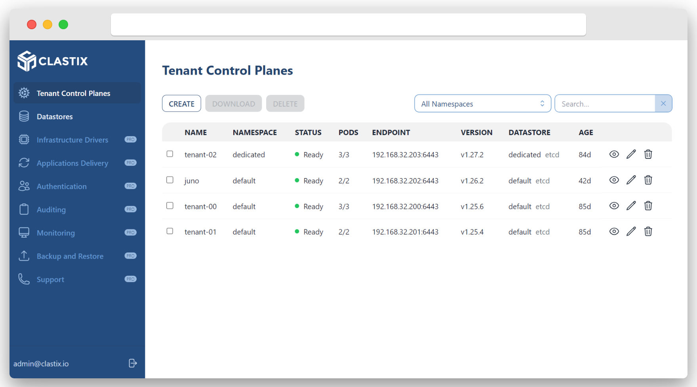
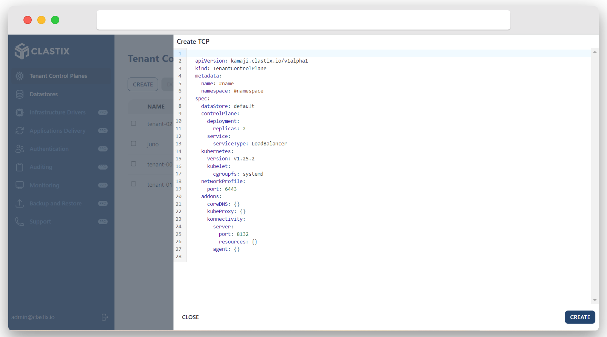
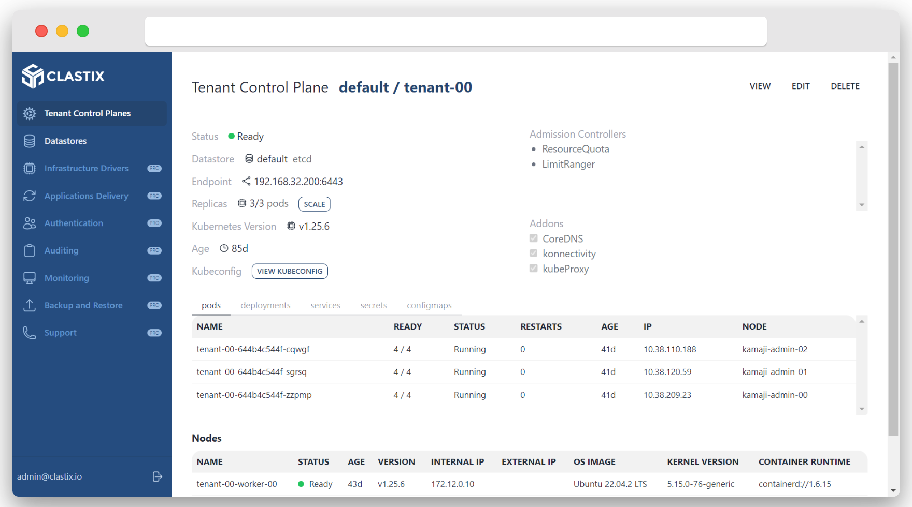
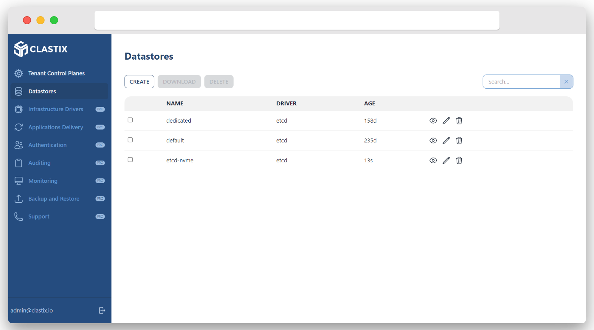

# Kamaji Console
This guide will introduce you to the basics of the Kamaji Console, a web UI to help you to view and control your Kamaji setup.

## Install with Helm
The Kamaji Console is a web interface running on the Kamaji Management Cluster that you can install with Helm. Check the Helm Chart [documentation](https://github.com/clastix/kamaji-console) for all the available settings.

The Kamaji Console requires a Secret in the Kamaji Management Cluster that contains the configuration and credentials to access the console from the browser. You can have the Helm Chart generate it for you, or create it yourself and provide the name of the Secret during installation. Before to install the Kamaji Console, access your workstation, replace the placeholders with actual values, and execute the following command:

```bash
# The secret is required, otherwise the installation will fail
cat <<EOF | kubectl apply -f -
apiVersion: v1
kind: Secret
type: Opaque
metadata:
  name: kamaji-console
  namespace: kamaji-system
data:
  # Credentials to login into console
  ADMIN_EMAIL: <email>
  ADMIN_PASSWORD: <password>
  # Secret used to sign the browser session
  JWT_SECRET: <jwtSecret>
  # URL where the console is accessible: https://<hostname>/ui
  NEXTAUTH_URL: <nextAuthUrl>
EOF
```

Install the Chart with the release name `console` in the `kamaji-system` namespace:

```
helm repo add clastix https://clastix.github.io/charts
helm repo update
helm -n kamaji-system install console clastix/kamaji-console
```

Show the status:

```
helm status console -n kamaji-system
```

## Access the Kamaji Console
Once installed, forward the console service to the local machine:

```
kubectl -n kamaji-system port-forward service/console-kamaji-console 8080:80
Forwarding from 127.0.0.1:8080 -> 3000
Forwarding from [::1]:8080 -> 3000
```

and point the browser to `http://127.0.0.1:8080/ui` to access the console. Login with credentials you stored into the secret.

!!! note "Expose with Ingress"
     The Kamaji Console can be exposed with an ingress. Refer the Helm Chart documentation on how to configure it properly.

## Explore the Kamaji Console
The Kamaji Console provides a high level view of all Tenant Control Planes configured in your Kamaji setup. When you login to the console you are brought to the Tenant Control Planes view, which allows you to quickly understand the state of your Kamaji setup at a glance. It shows summary information about all the Tenant Control Plane objects, including: name, namespace, status, endpoint, version, and datastore.



From this view, you can also create a new Tenant Control Plane from a basic placeholder in yaml format:



### Working with Tenant Control Plane
From the main view, clicking on a Tenant Control Plane row will bring you to the detailed view. This view shows you all the details about the selected Tenant Control Plane, including all child components: pods, deployment, service, config maps, and secrets. From this view, you can also view, copy, and download the `kubeconfig` to access the Tenant Control Plane as tenant admin. 



### Working with Datastore
From the menu bar on the left, clicking on the Datastores item, you can access the list of provisioned Datastores. It shows a summary about datastores, including name and the used driver, i.e. etcd, mysql, and postgresql.



From this view, you can also create, delete, edit, and inspect the single datastore. 

### Additional Operations
The Kamaji Console offers additional capabilities as part of the commercial edition Clastix Operating Platform:

- Infrastructure Drivers Management
- Applications Delivery via GitOps Operators
- Centralized Authentication and Access Control
- Auditing and Logging
- Monitoring
- Backup & Restore

!!! note "Ready for more?"
    To purchase entitlement to Clastix Operating Platform please contact hello@clastix.io.

