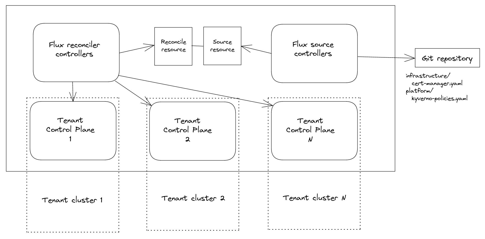

# Manage tenant resources GitOps-way from the admin cluster

In this guide, you can learn how to apply applications and resources in general, the GitOps-way, to the Tenant Control Planes.

An admin may need to apply a specific workload into tenant control planes and ensure is constantly reconciled, no matter what the tenants will do in their clusters.

Examples include installing monitoring agents, ensuring specific policies, installing infrastructure operators like Cert Manager and so on.

## Flux as the GitOps operator

As GitOps ensures a constant reconciliation to a Git-versioned desired state, Flux can satisfy the requirement of those scenarios.

In particular, the controllers that reconcile [resources](https://fluxcd.io/flux/concepts/#reconciliation) support communicating to external clusters.

In this scenario the Flux toolkit would run in the *admin cluster*, with reconcile controllers reconciling resources into *tenant clusters*.



This is something possible as the Flux reconciliation Custom Resources specifications provide ability to specify `Secret` which contain a `kubeconfig` - here you can find the related documentation for both [`Kustomization`](https://fluxcd.io/flux/components/kustomize/kustomization/#remote-clusters--cluster-api) and [`HelmRelease`](https://fluxcd.io/flux/components/helm/helmreleases/#remote-clusters--cluster-api) CRs.

## Quickstart

Once a `TenantControlPlane` is [deployed](https://kamaji.clastix.io/getting-started/#deploy-tenant-control-plane), the kubeconfig for the admin user can be found in a `Secret` named as *<tenant name>-admin-kubeconfig*, in the same `Namespace` where the resource has been created.

Let's suppose a `TenantControlPlane` named *tenant1* has been deployed in the *tenants* `Namespace`, a `Secret` named *tenant1-admin-kubeconfig* is created in the *tenants* `Namespace`.


```shell
$ kubectl get tenantcontrolplanes.kamaji.clastix.io -n tenants
NAME      VERSION   STATUS   CONTROL-PLANE-ENDPOINT   KUBECONFIG                 AGE
tenant1   v1.25.1   Ready    172.18.0.2:31443         tenant1-admin-kubeconfig   108s
```

> As the *admin* user has *cluster-admin* `ClusterRole` it will have the necessary privileges to operate on Custom Resources too.

Given that Flux it's installed in the *admin cluster* - guide [here](https://fluxcd.io/flux/installation/) - resources can be ensured for specifics tenant clusters, by filling the `spec.kubeConfig` field of the Flux reconciliation resource.

For example, it might be needed to ensure [cert-manager](https://cert-manager.io/) is installed into a *tenant1* cluster with Helm. It can be done by declaring an `HelmRelease` as follows:

```yaml
apiVersion: helm.toolkit.fluxcd.io/v2beta1
kind: HelmRelease
metadata:
  name: tenant1-cert-manager
  namespace: tenants
spec:
  interval: 5m
  chart:
    spec:
      kubeConfig: tenant1-admin-kubeconfig
      chart: jetstack/cert-manager 
      version: '4.0.x'
      sourceRef:
        kind: HelmRepository
        name: jetstack
        namespace: flux-system
      interval: 1m
  values:
    replicaCount: 2
```

and applying it in the *admin cluster*, alongside the related *jetstack* `HelmRepository`, in the *tenants* `Namespace`.

## Conclusion

This way tenant resources can be ensured from a single pane of glass, from the *admin cluster*.

No matter what the tenant users will do on the *tenant cluster*, the Flux reconciliation controllers wirunning in the *admin cluster* will ensure the desired state declared by the reconciliation resources applied existing in the *admin cluster*, will be reconciled in the *tenant cluster*.

Furthermore, this approach does not need to have in each tenant cluster nor Flux neither applied the related reconciliation Custom Resorces.

